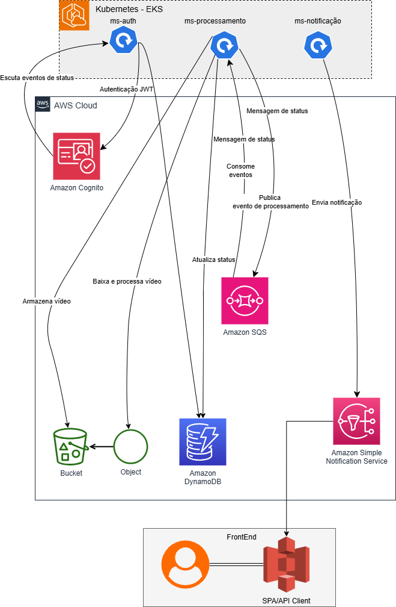
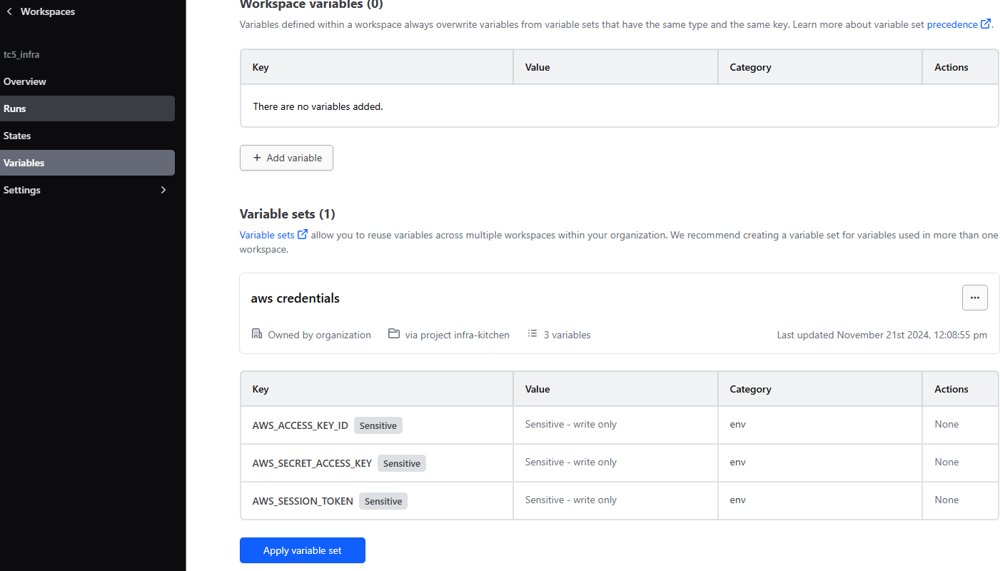
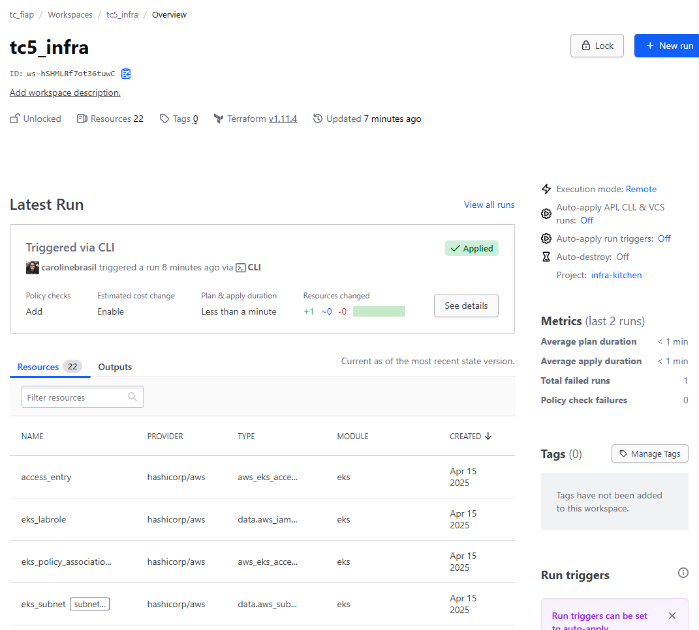

# tc5-infra

Este repositório contém os manifestos de infraestrutura como código do Tech Challenge 5, desenvolvidos em Terraform para provisionar recursos na AWS. O objetivo é fornecer uma base robusta e escalável para o processamento de vídeos, utilizando os seguintes serviços:

- **S3**: Armazenamento de vídeos a serem processados.
- **Cognito**: Gerenciamento de autenticação e autorização.
- **DynamoDB**: Banco de dados não relacional para armazenar dados e status do processamento.
- **EKS**: Plataforma Kubernetes para orquestração de containers de microsserviços.

Abaixo, você encontrará informações sobre a arquitetura técnica, pré-requisitos, configuração do ambiente e os comandos necessários para implementar o projeto.

### Arquitetura técnica

#### Pré-requisitos e configuração de ambiente

- Terraform
- Git
- Credenciais AWS
- [Conta no Terraform HCP](https://app.terraform.io/app/tc_fiap/workspaces)

#### Passos para implementar o projeto usando uma conta da AWS Academy:

1. Inicie o laboratório e visualize as credenciais da AWS Academy.
2. Clique no botão "AWS Details" e, em seguida, pressione o botão "AWS CLI" para exibir as credenciais.
3. Copie e cole o conteúdo das credenciais diretamente no terminal no diretório `~/.aws/credentials`.
4. Atualize a opção "Settings > Variable Set" nos workspaces do HCP **tc5-infra** com os valores das credenciais AWS: `AWS_ACCESS_KEY_ID`, `AWS_SECRET_ACCESS_KEY` e `AWS_SESSION_TOKEN`.

### Integração com HCP

Esta infraestrutura é provisionada utilizando o [HCP Terraform](https://developer.hashicorp.com/terraform/cloud-docs), uma plataforma que centraliza e gerencia as execuções do Terraform em um ambiente controlado e consistente. O HCP Terraform simplifica a colaboração entre equipes, permitindo o compartilhamento seguro de estados e configurações, além de oferecer melhor visualização com histórico de mudanças e logs. Para contribuir efetivamente, cada membro da equipe deve possuir uma conta na plataforma e estar devidamente configurado para acessar os workspaces do projeto.

#### Plan e Apply

Cada `push` para o repositório aciona um plan do Terraform que informa as possíveis alterações na infraestrutura. Após o `merge`, outro plan é executado no Terraform, seguido por um `apply`. Você pode acompanhar essas ações clicando nas verificações do GitHub, que redireciona para a plataforma HCP, onde é possível ter informações e logs detalhados sobre o processo de atualização.

> Comandos utilizados
> - `terraform init` - comando usado para inicializar o Terraform no diretório local;
> - `terraform fmt` - formata os arquivos `.tf` corrigindo a indentação;
> - `terraform validate` - verifica se uma configuração é sintaticamente válida e internamente consistente, independentemente de quaisquer variáveis fornecidas ou estado existente;
>- `terraform plan` - cria o plano de execução para visualizar as alterações na infraestrutura do provedor.
